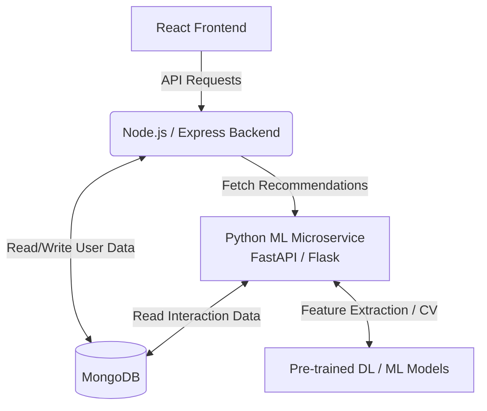

<div align="center">
  <h1>🛒 EasyCart</h1>
  <p><strong>A Scalable, Full-Stack E-Commerce Platform</strong></p>

  [](https://easycart-m8dj.onrender.com/)
</div>

<br />

## 📖 Overview

**EasyCart** is a modern, comprehensive e-commerce solution engineered with the MERN stack (MongoDB, Express.js, React.js, Node.js). Designed with both the end-user and administrator in mind, it delivers a seamless shopping experience backed by a robust and secure RESTful API.

*➔ [Also see our Future Plans for an AI Recommendation Engine](#future-plans)*

## ✨ Key Features

### 👤 For Users:
- **Robust Authentication:** Secure JWT-based user authentication, password resets, and authorization via bcrypt.
- **Complete Shopping Workflow:** Intuitive product discovery, advanced search, cart management, and a seamless checkout process.
- **Secure Payments:** Integrated **Razorpay** payment gateway for secure, real-time transaction processing.
- **User Profile Management:** Manage profile details, address books, and view a comprehensive order history.

### 🛡️ For Admins:
- **Admin Dashboard:** Centralized, high-level overview metrics for managing the entire store ecosystem.
- **Product & Inventory Monitoring:** Professionally add, update, delete, and monitor product stock levels and categories in real-time.
- **Order Handling:** Streamlined end-to-end order processing, fulfillment tracking, and user status updates.
- **Review & Comment Moderation:** Dedicated interface to monitor, manage, and moderate user reviews and comments to maintain store quality.
- **Cloud Media Management:** Efficient product image hosting, resizing, and delivery via **Cloudinary**.

## 🛠️ Technology Stack

| Category | Technologies |
|---|---|
| **Frontend** | React.js (Vite), Redux Toolkit, Material UI, React Router, Axios |
| **Backend** | Node.js, Express.js, JWT, bcryptjs, Nodemailer |
| **Database** | MongoDB, Mongoose |
| **Integrations**| Razorpay (Payments), Cloudinary & Multer (Media) |

## ⚙️ Local Development Setup

To run this project locally, follow these steps:

### 1. Clone the repository
```bash
git clone https://github.com/vikashkr96/EasyCart.git
cd EasyCart
```

### 2. Install Dependencies
```bash
# Install backend dependencies
npm install

# Install frontend dependencies
npm run build
```

### 3. Environment Configuration
Create a `config.env` file in `backend/config/` and populate it with your credentials:
```env
PORT=3000
NODE_ENV=DEVELOPMENT
MONGO_URI=your_mongodb_uri
JWT_SECRET=your_jwt_secret
JWT_EXPIRE=5d
COOKIE_EXPIRE=5
CLOUDINARY_NAME=your_cloudinary_name
API_KEY=your_cloudinary_api_key
API_SECRET=your_cloudinary_api_secret
RAZORPAY_API_KEY=your_razorpay_key
RAZORPAY_API_SECRET=your_razorpay_secret
SMTP_HOST=smtp.gmail.com
SMTP_PORT=465
SMTP_SERVICE=gmail
SMTP_MAIL=your_email@gmail.com
SMTP_PASSWORD=your_app_password
```

### 4. Start the Application
```bash
# Terminal 1: Start the backend server
npm run dev

# Terminal 2: Start the frontend server
cd frontend
npm run dev
```

---

<a id="future-plans"></a>
## 🚀 Future Roadmap: ML Recommendation Engine

As part of the future vision for this platform, I am planning to integrate a personalized **Machine Learning Recommendation Engine** to elevate the user experience. By leveraging my expertise in **Python, Data Analytics, Deep Learning, and Computer Vision**, the platform will intelligently track user preferences (e.g., recently viewed, reviewed products) and serve highly personalized product suggestions.

**Proposed Architecture Flow:**



---
<div align="center">
  <p>Designed and Developed by <a href="https://github.com/vikashkr96">Vikash Kumar</a></p>
</div>
